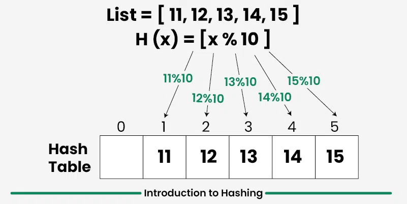

# Hashing in Java
-> In simple terms hashing does the precomputation to store the count of elements and then fetching according to the requirements.

**Hashing in Data Structure**

  Hashing is a technique used in data structures that efficiently stores and retrieves data in a way that allows for quick access.

 *Hashing involves mapping data to a specific index in a hash table (an array of items) using a hash function. It 
 enables fast retrieval of information based on its key.*

*image of hashing*


# HashMap in java 
 - A HashMap is a part of Java’s Collection Framework and implements the Map interface. It stores elements in key-value pairs, where, Keys are unique. and Values can be duplicated.
 - Internally uses Hashing, hence allows efficient key-based retrieval, insertion, and removal with an average of O(1) time.

```Syntax for HashMap in java
 HashMap<String, Integer> hashMap = new HashMap<>();
  - this is how we declare the HashMap in java
